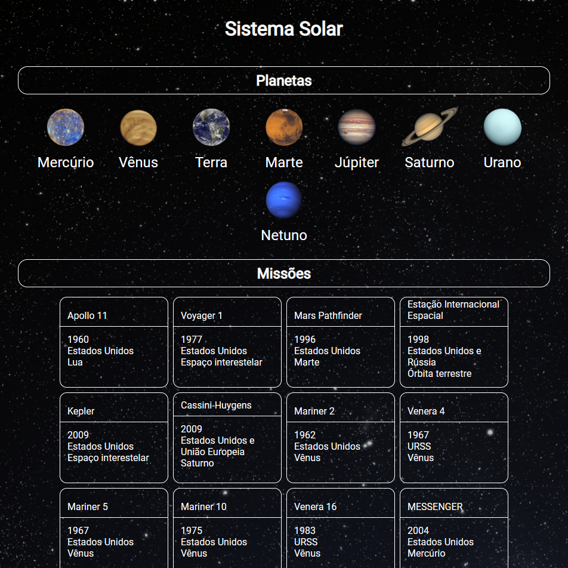

# ☀️ Solar System 🌑




## Estilização do projeto em andamento

## 📓 Sobre

<details>
  <summary>Sobre</summary>
  <br />

  Projeto desenvolvido por [Erik Ferreira](https://www.linkedin.com/in/erikferreiralima/).
  Este projeto foi disponibilizado pela [Trybe](https://www.betrybe.com/) onde tive exito na entrega de 100% dos requisitos solicitados.

  Foi feito o desenvolvimento de uma aplicação React onde o desafio foi desenvolver testes unitários para o frontend da aplicação utilizando React Testing Library.

  <br />
</details>
  <br />

  ### Habilidades utilizadas durante o desenvolvimento 💻

<details>
  <summary>Habilidades</summary>
  <br />

  * Desenvolvimento de aplicações React
  * Teste de uma aplicação frontend utilizando React Testing Library
  * Metodologia ágil(Kanban)

  <br />
</details>

<details>
  <summary>Ferramentas</summary>
  <br />

  * React.js
    * Components de Classes
  * HTML5
  * CSS3
  * JavaScript
  * React Testing Library
  * Jest
  * Git


  <br />
</details>

  <br />

  ### 📚 Documentação 📚

  <details>
    <summary>Documentação</summary>
    <br />

    Para clonar o repositório do projeto, basta seguir os seguintes passos:

    Faça o fork do repositório:
    ```
    Tutorial no link https://github.com/UNIVALI-LITE/Portugol-Studio/wiki/Fazendo-um-Fork-do-reposit%C3%B3rio
    ```
    Clone o repositório:
    ```
    git clone git@github.com:"SeuNomeNoGitHub"/Solar-System.git
    ```
    Apos ter o repositório clonado em sua maquina, basta executar o comando:
    ```
    cd Solar-System
    ```
    E então executar os comando para que a aplicação funcione:
    ```
    npm install
    npm start

  </details>

  <br />

### ©️ Aviso de direitos autorais

</br>

Esse projeto foi desenvolvido para propósitos de aprendizagem, todo o código e documentação são de [Erik-EFL](https://github.com/Erik-EFL) autoria e os direitos pertencem exclusivamente a [Erik-EFL](https://github.com/Erik-EFL). É permitido baixar ou clonar o repositório para fins de estudo. Contudo, não é permitido publicar cópias totais ou parciais. Este aviso não cobre bibliotecas e dependências, estas estão sujeitas a suas respectivas licenças.
